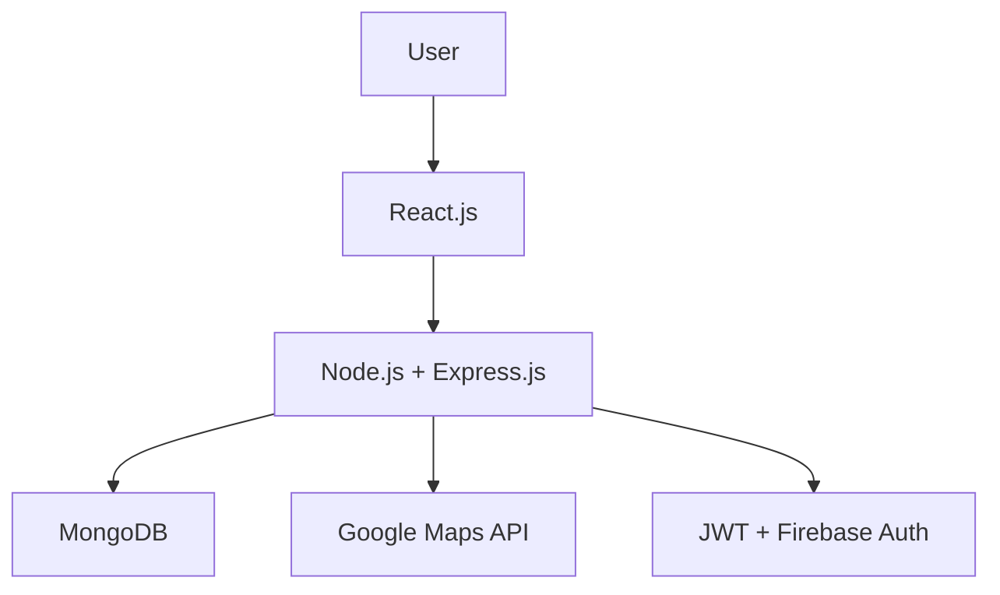

# 🚗 Carpooling System - MoveINSync

**A smart, privacy-focused ride-sharing platform**

## Project Details

- **👤 Name :** Kumar Roushan
- **🎓 Roll No:** E22CSEU0798
- **🔗 GitHub Repository:** [CarPooling MoveINSync](https://github.com/KumarRoushan9234/car_polling_MoveINSync)
- **🚀 Live Project:** [Carma Carpool](https://carma-carpool.vercel.app/)

## 📝 Introduction

The **Carpooling System** helps drivers and passengers connect seamlessly. It is designed to:  
✅ Reduce travel costs & congestion 🚦  
✅ Lower environmental impact 🌍  
✅ Ensure privacy, security, and smart ride-matching 🔒

## 🛠 Technology Stack

### Frontend (React)

- ⚛️ React.js (Tailwind CSS & DaisyUI)
- 🎨 Framer Motion (smooth animations)
- 📍 Google Maps API (location & route visualization)

### Backend (Node.js + Express)

- 🛡 JWT-based authentication (Email & Firebase Phone verification)
- 🔄 RESTful API with Node.js & Express.js
- 💾 MongoDB with Mongoose
- 🗺 Google Maps API (routes & recommendations)

## 🔐 Privacy & Security Features

✅ **MFA Authentication** → Email & Phone Verification Required  
✅ **Phone Number Masking** → Hidden until ride confirmation  
✅ **Emergency SOS Button** → Share ride details in real-time  
✅ **Report User Feature** → Report inappropriate behavior  
✅ **End-to-End Encrypted Messaging** → Secure in-app chat

## 📌 Core Functionalities

### 1️⃣ Ride Creation & Joining

🔹 **Ride Creation:**

1. Enter Pickup & Drop Locations
2. Select Departure Time & Seats
3. Add Vehicle Details & Preferences
4. Store Ride with Geolocation

🔹 **Ride Joining:**

1. Search for available rides
2. System suggests best-matching rides
3. Send a join request → Driver approves/rejects
4. Once approved, ride details are shared

### 2️⃣ Intelligent Ride Matching

🔍 Match rides based on:  
✅ **Proximity** (starting point closeness)  
✅ **Route Similarity** (overlapping route)  
✅ **Timing** (departure compatibility)  
✅ **Preferences** (music, pet-friendly, gender, etc.)

### 3️⃣ Route Matching Algorithm

🚀 Uses **Google Maps API** + **Haversine Formula** to:  
✔️ Calculate the shortest & fastest routes  
✔️ Optimize ride matching efficiency

### 4️⃣ Ride Cost Calculation (Dynamic Pricing)

💰 Factors affecting the fare:  
✅ **Base Fare** (fixed initial cost)  
✅ **Per KM Charge** (varies by city)  
✅ **Traffic & Surge Pricing** (dynamic adjustments)

## ⚡ System Resilience & Fault Tolerance

✅ **1. Atomic Transactions (ACID Compliance)**

- If any step in ride creation fails, the system **rolls back changes** to prevent data corruption.

✅ **2. Circuit Breaker Pattern (For External APIs)**

- **Auto-retries failed API requests** (e.g., Google Maps API) after a cooldown period to prevent system overload.

## 📌 Trade-offs & Design Decisions

🔹 **Google Maps API vs. Custom Mapping Solution**  
✅ **Pros:** Highly accurate routes, real-time data  
❌ **Cons:** Can be slow & expensive for high-traffic apps  
💡 **Solution:** Caching frequently searched locations to reduce API calls

🔹 **Privacy vs. Communication Convenience**  
✅ **Pros:** Phone number masking prevents spam  
❌ **Cons:** Users must rely on in-app chat instead of direct calls

## 📐 System Architecture Overview

## 📸 Screenshots

### Home Page & Ride Listing

| Home Page                                                 | Ride Listing                                                      |
| --------------------------------------------------------- | ----------------------------------------------------------------- |
|  |  |

### Ride Details & User Profile

| Ride Details                                                      | User Profile                                                      |
| ----------------------------------------------------------------- | ----------------------------------------------------------------- |
|  |  |

### Chat Inbox & Message View

| Chat Inbox                                                      | Message View                                                      |
| --------------------------------------------------------------- | ----------------------------------------------------------------- |
|  |  |

### Booking Confirmation & Payment Page

| Booking Confirmation                                         | Payment Page                                                 |
| ------------------------------------------------------------ | ------------------------------------------------------------ |
|  |  |

📌 **More screenshots are available in the [`screenshots/`](screenshots/) folder.**
